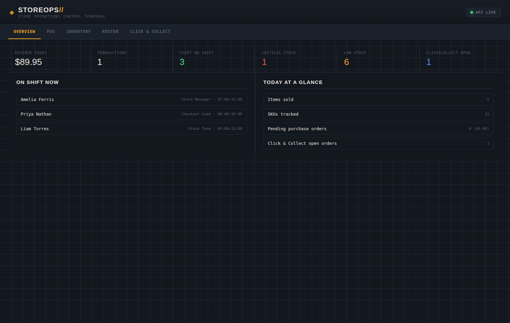
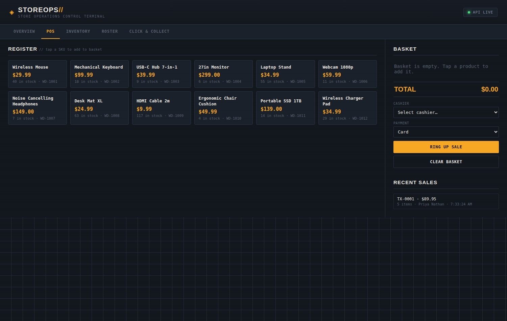
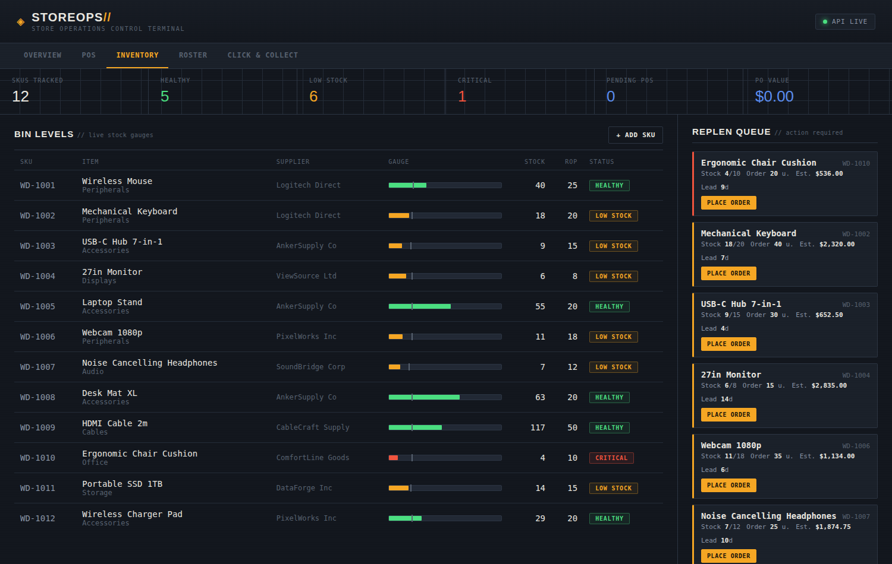
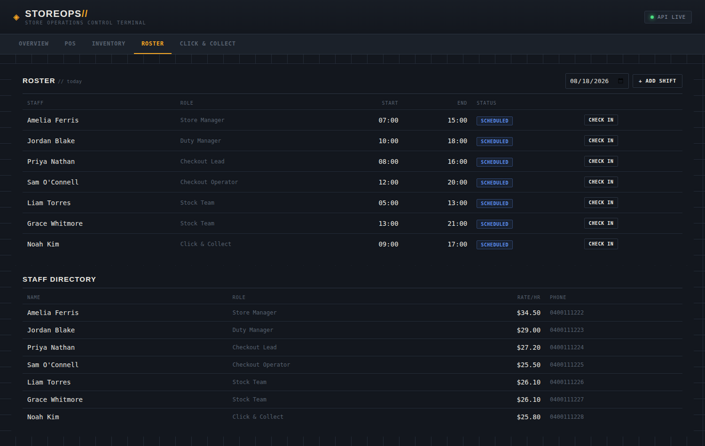
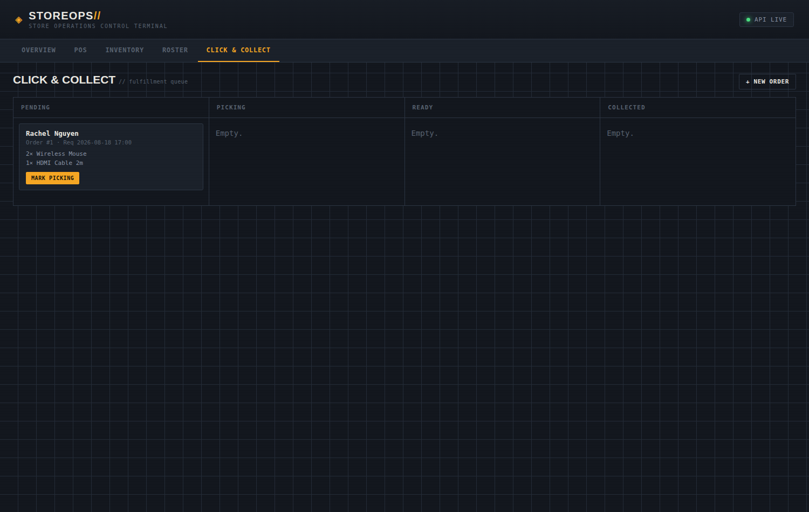

# STOREOPS // Store Operations Control Terminal

An all-in-one store operations dashboard, in the spirit of what a retail
chain (Coles, Woolworths, Target, etc.) runs behind the scenes — one system
tying together the point of sale, inventory replenishment, staff rostering,
and click & collect fulfillment, instead of four disconnected tools.



## What it does

**Overview** — a single glance at how the store is doing right now: today's
revenue and transaction count, who's on shift, stock health, and open
click & collect orders.

**POS** — a register screen. Tap products into a basket, pick a cashier and
payment method, ring up the sale. Stock is deducted immediately and flows
straight into the replenishment system.



**Inventory** — the replenishment engine: every SKU is scored Healthy / Low
/ Critical against a reorder point, with a live queue of what to reorder,
how much, and the estimated cost. Placing an order logs it with an expected
arrival date based on the supplier's lead time; receiving it restocks the
shelf.



**Roster** — shift scheduling per staff member, per day, with check-in /
check-out so "who's on shift now" on the Overview tab is always accurate.



**Click & Collect** — a kanban-style fulfillment queue
(Pending → Picking → Ready → Collected) for online orders, each with its
line items pulled from the same product catalog as the POS and inventory
modules.



## Why one system instead of four

A sale at the register should be able to affect stock levels, which should
be able to affect the reorder queue, which should be reflected on an
overview a store manager checks each morning. Real store-ops software
works this way — POS, inventory, and fulfillment aren't siloed, they share
one product catalog and one source of truth for stock. This project models
that: one `products.csv` is the single source of truth for stock, and every
module (POS, replenishment, click & collect) reads and writes through it.

## Stack

- **Backend:** Node.js, built only on the core `http` module — no
  `npm install` required, no framework.
- **Data:** CSV files under `backend/data/`, loaded into memory at boot and
  written back on every change. Transparent, diffable, and easy to inspect
  or reset by hand.
- **Frontend:** Plain HTML/CSS/JS, no build step, no framework — a
  single-page app with tab-based routing between the five modules.

Kept dependency-free on purpose — clone it, run `node backend/server.js`,
done.

## Project structure

```
store-ops-system/
├── backend/
│   ├── server.js                  # HTTP server + all routes
│   ├── lib/
│   │   ├── csv.js                 # CSV parse/write helpers
│   │   ├── csvStore.js            # generic CSV-backed entity store factory
│   │   ├── store.js               # products + purchase orders
│   │   ├── replenishment.js       # (s, Q) reorder policy: status + suggestions
│   │   ├── pos.js                 # sales: ring up, stock deduction, daily stats
│   │   ├── roster.js              # staff + shift scheduling, who's on now
│   │   └── clickCollect.js        # online order intake + fulfillment status
│   └── data/
│       ├── products.csv           # shared product catalog + stock levels
│       ├── orders_history.csv     # purchase order log (supplier restocking)
│       ├── sales.csv              # POS transaction line items
│       ├── staff.csv              # staff directory
│       ├── roster.csv             # shift schedule
│       ├── click_collect_orders.csv
│       └── click_collect_items.csv
├── frontend/
│   ├── index.html                 # tab shell: Overview / POS / Inventory / Roster / Click&Collect
│   ├── style.css
│   └── app.js
├── docs/                          # screenshots used in this README
├── package.json
└── README.md
```

## Running it locally

You need Node.js 18+. Nothing else.

```bash
# 1. Start the API (from the project root)
node backend/server.js
# → Store Ops API listening on http://localhost:4000

# 2. In a second terminal, serve the frontend as static files
cd frontend
python3 -m http.server 8080
# → open http://localhost:8080 in your browser
```

To point the frontend at a different API host (e.g. once deployed), set
this before `app.js` loads:

```html
<script>window.STOREOPS_API_BASE = "https://your-api.example.com/api";</script>
<script src="app.js"></script>
```

## API reference

**Inventory / replenishment**
| Method | Endpoint | Description |
|---|---|---|
| GET | `/api/products` | List all SKUs |
| POST | `/api/products` | Register a new SKU |
| PUT | `/api/products/:id` | Update a SKU |
| DELETE | `/api/products/:id` | Remove a SKU |
| GET | `/api/replenishment` | Suggested reorders, ranked by urgency |
| POST | `/api/replenishment/:id/order` | Place a purchase order for a SKU |
| GET | `/api/orders` | Purchase order history |
| POST | `/api/orders/:orderId/receive` | Mark a PO received, restock the SKU |

**POS**
| Method | Endpoint | Description |
|---|---|---|
| POST | `/api/pos/sale` | Ring up `{ items: [{product_id, qty}], payment_method, cashier }` |
| GET | `/api/pos/sales` | Sales line-item history |

**Staff & rostering**
| Method | Endpoint | Description |
|---|---|---|
| GET | `/api/staff` | List staff |
| POST | `/api/staff` | Add a staff member |
| GET | `/api/roster?date=YYYY-MM-DD` | Shifts for a date |
| POST | `/api/roster` | Schedule a shift |
| POST | `/api/roster/:shiftId/checkin` | Check a staff member in |
| POST | `/api/roster/:shiftId/checkout` | Check a staff member out |

**Click & collect**
| Method | Endpoint | Description |
|---|---|---|
| GET | `/api/click-collect` | List orders with their line items |
| POST | `/api/click-collect` | Create an order `{ customer_name, customer_phone, requested_time, items }` |
| POST | `/api/click-collect/:orderId/status` | Advance status: pending → picking → ready → collected |

**Overview**
| Method | Endpoint | Description |
|---|---|---|
| GET | `/api/overview` | Aggregated stats across all modules for the dashboard header |

## Ideas for extending it

- Swap CSV storage for SQLite/Postgres (only `csvStore.js` would need to change)
- Multi-store support — a `store_id` field on every entity
- Barcode scanner input on the POS screen (most scanners just type + Enter)
- Shift labor cost vs sales, on the Overview tab
- Email/SMS notification when a click & collect order goes "ready"
- Auth + role-based views (cashier vs store manager)

---

## Getting this into your GitHub repo and portfolio

### 1. Push it to GitHub

From inside the `store-ops-system` folder:

```bash
git init
git add .
git commit -m "Initial commit: store ops system (POS, inventory, roster, click & collect)"
git branch -M main
git remote add origin https://github.com/<your-username>/store-ops-system.git
git push -u origin main
```

Create the repo first at github.com/new — leave it empty (no README, no
`.gitignore`), since this project already has both.

### 2. Make the repo portfolio-ready

- **Pin it** on your GitHub profile (Profile → Customize your pins).
- **Add topics**: `nodejs`, `retail`, `point-of-sale`, `inventory-management`,
  `dashboard`.
- **Fill in the "About" section** with a one-line description and, once
  deployed, a live demo link.
- This README renders on the repo's homepage — the screenshots above are a
  good first impression, but swap in your own once you've customized data.

### 3. Deploy it for a working live demo

- **Backend:** Render, Railway, or Fly.io — point at this repo, start
  command `node backend/server.js`.
- **Frontend:** GitHub Pages, Netlify, or Vercel serving the `frontend/`
  folder. Set `window.STOREOPS_API_BASE` to your deployed backend URL.

### 4. For your portfolio write-up

Good angles to cover: the problem (store ops usually means several
disconnected tools), the approach (one shared product catalog feeding POS,
replenishment, and fulfillment), and one interesting technical decision —
e.g. "CSV as the data layer for transparency" or "zero-dependency Node
backend." Link both the live demo and the repo.
